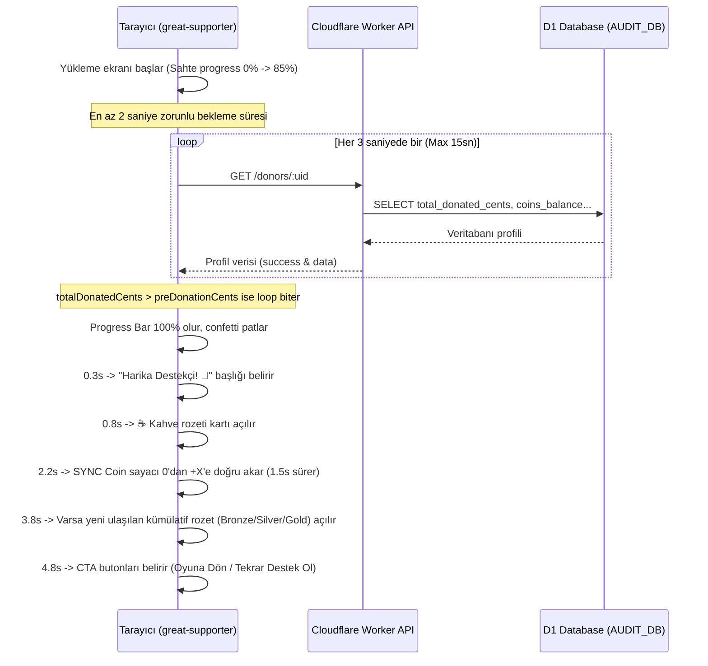

# Lemon Squeezy Bağış & Satış Sistemi - Yayına Alım Raporu

Bu rapor, **Know & Conquer** platformuna entegre edilen Lemon Squeezy bağış, dijital koin (SYNC) ve rozet sisteminin mimari, veritabanı, güvenlik ve arayüz detaylarını içermektedir.

---

## 1. Genel Bakış ve Yasal Model (Digital Goods)

Lemon Squeezy üzerinde doğrudan bir "donation" (bağış) kategorisi bulunmadığı için sistem **Digital Goods & Services** (Dijital Ürün ve Hizmetler) modeli üzerine kurulmuştur:
* **SYNC Para Birimi**: Kullanıcı yaptığı her bağışta/satın alımda cent başına 1 SYNC kazanır ($1 = 100 SYNC). Bu yapı yasal olarak kullanıcının bir dijital emtia satın almasını simgeler ve Lemon Squeezy kurallarıyla %100 uyumludur.
* **Kümülatif Rozetler**: Kullanıcının yaptığı tüm satın alımların toplam tutarı hesaplanarak (lifetime), belirli eşiklere ulaştığında profiline özel rozetler verilir.
* **Optimistic UI Karşıtı Yapı**: Sistemde güvenlik ve tutarlılık gereği asla "tahmini" veya "iyimser" veri gösterilmez. Tüm coin ve rozet kazanımları yalnızca Lemon Squeezy Webhook'u veritabanına işlendikten sonra kullanıcıya gösterilir.

---

## 2. Veritabanı Mimarisi (Cloudflare D1 - `AUDIT_DB`)

Tüm veriler mevcut `AUDIT_DB` veritabanında saklanır. İlişkisel bütünlük ve idempotency (mükerrer kayıt önleme) kuralları uygulanmıştır.

### A. `store_events` Tablosu
Lemon Squeezy'den gelen tüm ham webhook payload'larını ve işleme durumlarını saklar.

```sql
CREATE TABLE IF NOT EXISTS store_events (
  id               TEXT PRIMARY KEY DEFAULT (lower(hex(randomblob(16)))),
  ls_event_id      TEXT UNIQUE NOT NULL CHECK (length(ls_event_id) BETWEEN 1 AND 128),
  event_name       TEXT NOT NULL CHECK (length(event_name) BETWEEN 1 AND 64),
  uid              TEXT CHECK (uid IS NULL OR length(uid) BETWEEN 1 AND 128),
  ls_order_id      TEXT CHECK (ls_order_id IS NULL OR length(ls_order_id) BETWEEN 1 AND 128),
  ls_customer_id   TEXT CHECK (ls_customer_id IS NULL OR length(ls_customer_id) BETWEEN 1 AND 128),
  ls_variant_id    TEXT CHECK (ls_variant_id IS NULL OR length(ls_variant_id) BETWEEN 1 AND 128),
  product_name     TEXT CHECK (product_name IS NULL OR length(product_name) BETWEEN 1 AND 255),
  amount_cents     INTEGER NOT NULL CHECK (amount_cents > 0),
  currency         TEXT NOT NULL DEFAULT 'USD' CHECK (length(currency) = 3),
  customer_email   TEXT CHECK (customer_email IS NULL OR length(customer_email) BETWEEN 3 AND 255),
  customer_name    TEXT CHECK (customer_name IS NULL OR length(customer_name) BETWEEN 1 AND 255),
  donor_alias      TEXT CHECK (donor_alias IS NULL OR length(donor_alias) BETWEEN 1 AND 100),
  raw_payload      TEXT NOT NULL,
  sig_valid        INTEGER NOT NULL DEFAULT 1 CHECK (sig_valid IN (0, 1)),
  error_info       TEXT,
  coins_earned     INTEGER NOT NULL DEFAULT 0 CHECK (coins_earned >= 0),
  created_at       TEXT NOT NULL DEFAULT (strftime('%Y-%m-%dT%H:%M:%fZ', 'now'))
);
```

### B. `donor_profiles` Tablosu
Bağışçıların istatistiklerini, toplam bağış miktarlarını ve SYNC bakiyelerini tutar.

```sql
CREATE TABLE IF NOT EXISTS donor_profiles (
  id                   TEXT PRIMARY KEY DEFAULT (lower(hex(randomblob(16)))),
  uid                  TEXT UNIQUE CHECK (uid IS NULL OR length(uid) BETWEEN 1 AND 128),
  display_name         TEXT NOT NULL DEFAULT 'Anonim' CHECK (length(display_name) BETWEEN 1 AND 50),
  total_donated_cents  INTEGER NOT NULL DEFAULT 0 CHECK (total_donated_cents >= 0),
  badge_tier           TEXT CHECK (badge_tier IS NULL OR badge_tier IN ('bronze', 'silver', 'gold')),
  is_anonymous         INTEGER NOT NULL DEFAULT 0 CHECK (is_anonymous IN (0, 1)),
  coins_balance        INTEGER NOT NULL DEFAULT 0 CHECK (coins_balance >= 0),
  created_at           TEXT NOT NULL DEFAULT (strftime('%Y-%m-%dT%H:%M:%fZ', 'now')),
  updated_at           TEXT NOT NULL DEFAULT (strftime('%Y-%m-%dT%H:%M:%fZ', 'now'))
);
```

### C. `badges` Tablosu (Mevcut Tabloya Entegrasyon)
Rozetler bu tabloda `period_id = 'lifetime'` ve `rank = 1` olarak idempotent şekilde tutulur. `(uid, badge_type, period_id)` unique constraint'ine sahiptir.

---

## 3. Cloudflare Worker Yapısı (`syncron-worker`)

Worker, tüm webhook doğrulama ve API sunma işlemlerini gerçekleştirir.

### A. Webhook Güvenliği ve Doğrulama (`routes/store.ts`)
1. **HMAC-SHA256 Doğrulama**: Lemon Squeezy'den gelen ham request body'si, kullanıcının `LS_WEBHOOK_SECRET` anahtarı ile SHA-256 algoritması kullanılarak doğrulanır. İmza geçersizse işlem yarıda kesilir (`401 Unauthorized`).
2. **Sıfır Veri Kaybı Prensibi**: Webhook isteği ulaştığı anda, imza geçersiz veya kodda başka bir hata olsa dahi ham payload `store_events` tablosuna `sig_valid = 0` ve `error_info` ile birlikte kaydedilir. Veri hiçbir koşulda kaybolmaz.
3. **Idempotency (Çift Ödeme Önleme)**: Webhook olayının ID'si `event_name-order_id` formatında `ls_event_id` kolonuyla `UNIQUE` index'e yazılır. Lemon Squeezy isteği tekrar gönderirse `INSERT OR IGNORE` sayesinde veritabanı çift işlem yapmaz.

### B. Profil ve Rozet Dağıtımı (`services/lemonSqueezy.ts`)
* **`donor_starter` Rozeti (☕)**: Miktar gözetmeksizin bağış yapan tüm giriş yapmış kullanıcılara verilir.
* **Tier Rozetleri**: Toplam kümülatif bağış cents cinsinden kontrol edilerek otomatik verilir:
  * **Bronze (🥉)**: $\ge 500$ cents ($5 USD)
  * **Silver (🥈)**: $\ge 2000$ cents ($20 USD)
  * **Gold (🥇)**: $\ge 5000$ cents ($50 USD)

### C. Halka Açık API Endpoint'leri (`routes/donorApi.ts`)
* `GET /donors/top`: En yüksek bağış yapan ilk 50 kullanıcıyı döner (anonim olanların isimleri D1 düzeyinde maskelenir).
* `GET /donors/:uid`: Belirli bir kullanıcının bağış miktarını, rozet tier durumunu ve `coinsBalance` değerini döner.

---

## 4. Next.js Frontend Yapısı

### A. Bağış Arayüzü (`app/donate/DonateClient.tsx`)
* $1, $2, $5, $10 USD hızlı seçim butonları ve özel miktar giriş alanı.
* Lemon Squeezy ödeme sayfasına yönlendirilirken success redirect parametresi eklenir:
  `checkout[success_url] = https://syncron.polimelo.com/great-supporter`
* Yönlendirme öncesinde kullanıcının mevcut durumunu doğrulamak için tarayıcı `sessionStorage`'ına:
  - `pendingDonorUid` (Kullanıcının Firebase UID'si)
  - `preDonationCents` (Ödeme öncesi toplam bağış tutarı)
  değerleri yazılır.

### B. Harika Destekçi Sayfası (`app/great-supporter`)
Kullanıcı ödemeyi tamamladığında bu sayfaya yönlendirilir.



#### Tasarım Detayları:
* **Parçacık Efekti (Canvas)**: HTML5 Canvas üzerinde çalışan performansa duyarlı floating partiküller arka planı süsler.
* **SYNC Coin Sayacı**: Neon sarı (`#ffd700`) renginde, monospace font ile 0'dan kazanılan SYNC değerine (`requestAnimationFrame` ile 60fps) doğru akıcı bir şekilde yükselir.
* **Hata Durumu (Timeout)**: Webhook 15 saniye içinde işlenmezse, kullanıcıya işlemin ulaştığı fakat doğrulanmasının sürdüğü belirtilir ve profil sayfasına yönlendirme verilir (hatalı/boş veri asla gösterilmez).

---

## 5. Dağıtım ve Canlıya Geçiş Kılavuzu

### Adım 1: D1 Migration'ları Uygulama
Veritabanı tablolarını oluşturmak ve güncel koin sütunlarını eklemek için sırasıyla migrations dosyalarını çalıştırın:

```bash
# Yerel test ortamı için:
wrangler d1 migrations apply AUDIT_DB --local --cwd syncron-worker

# Canlı (Production) veritabanı için:
wrangler d1 migrations apply AUDIT_DB --remote --cwd syncron-worker
```

### Adım 2: Çevresel Değişkenler ve Secret Tanımlamaları
Lemon Squeezy API ve Webhook entegrasyonu için gerekli anahtarları Cloudflare Worker'a tanımlayın:

```bash
# Webhook imzalarını doğrulamak için:
wrangler secret put LS_WEBHOOK_SECRET --cwd syncron-worker

# Lemon Squeezy API'sini sorgulamak için (ilerideki satış entegrasyonları için):
wrangler secret put LS_API_KEY --cwd syncron-worker
```

### Adım 3: Lemon Squeezy Dashboard Yapılandırması
1. **Ürün**: Lemon Squeezy Dashboard -> Products sekmesinden yeni bir ürün ekleyin.
   - Tipini **Digital Goods** veya **Services** seçin.
   - Ödeme yapısını **Pay What You Want** yapın (Minimum $1.00 USD).
2. **Success Redirect**: Ürün ayarlarından yönlendirme linkini `https://syncron.polimelo.com/great-supporter` olarak ayarlayın.
3. **Webhook Tanımlama**: Settings -> Webhooks altından yeni bir Webhook oluşturun.
   - Hedef URL: `https://syncron-worker.ahmetcinar1283.workers.dev/webhooks/lemonsqueezy`
   - Olaylar (Events): Sadece `order_created` seçilmesi yeterlidir.
   - Signing Secret: Belirlediğiniz şifreyi **Adım 2**'deki `LS_WEBHOOK_SECRET` olarak tanımlayın.

### Adım 4: Frontend Yapılandırması (`.env.local`)
Next.js projenizin kök dizinindeki `.env.local` dosyasına Lemon Squeezy mağaza subdomain'inizi ve variant ID değerinizi girin:

```env
NEXT_PUBLIC_LEMON_SQUEEZY_STORE_SUBDOMAIN=sizin-magaza-adiniz
NEXT_PUBLIC_LEMON_SQUEEZY_VARIANT_ID=sizin-variant-id-degeriniz
```
