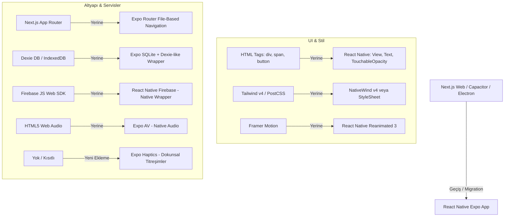

# Next.js'ten React Native (Expo) Geçiş Yol Haritası (Migration Roadmap)

Bu belge, **Syncron** oyununun Next.js (Web/Capacitor/Electron) mimarisinden **React Native (Expo)** platformuna native bir mobil deneyim ve üst seviye performans için nasıl taşınacağını açıklar.

> **Not (2026-09 refactor):** Belgedeki `app/src/games/*` (v1 motor) referansları kaldırılan ölü koda aittir. Güncel proje `src/` altına taşındı ve tek çalışan motor `src/game-engine`'dir (bkz. `src/game-engine/level-format`, `src/game-engine/solver`). Aşağıdaki yol adları tarihi bağlam için korunmuştur, güncel karşılıklarıyla birebir eşleşmeyebilir.

Aynı zamanda **React Native (Expo)** ile **Flutter** karşılaştırmasını sunarak neden React Native'in bu proje için en doğru tercih olduğunu, nelerin değişeceğini, nelerin aynı kalacağını ve yapay zeka ajanlarına (AI Agents) bu işi yaptırırken izlenecek adım adım fazları içerir.

---

## 1. Karar Analizi: React Native (Expo) vs. Flutter

Projeyi sıfırdan taşımak için önümüzde iki büyük mobil çerçeve (framework) seçeneği bulunmaktadır. Mevcut projenin yapısı ve sizin teknik birikiminiz doğrultusunda yapılan analiz şu şekildedir:

### Karşılaştırma Tablosu

| Kriter | React Native (Expo) | Flutter |
| :--- | :--- | :--- |
| **Geliştirici Dili** | **JavaScript / TypeScript (Mevcut Bilginiz)** | Dart (Yeni bir dil öğrenme gereksinimi) |
| **Kod Yeniden Kullanımı** | **~%50 - %60** (Tüm oyun fiziği, reducer'lar, Redux store, Firebase mimarisi birebir taşınır) | **~%0** (Tüm TypeScript kodunun baştan Dart diline yazılması gerekir) |
| **Yapay Zeka (AI) Hata Payı** | **Düşük / Orta**. AI ajanlar mevcut TS dosyalarını kopyalayıp doğrudan çalıştırabilir. | **Yüksek**. AI ajanların oyun mekaniklerini (buz kayması, elektrik akışı, kutu zincirlemesi vb.) Dart diline çevirirken hata yapma olasılığı çok yüksektir. |
| **Native Hissiyat** | **Mükemmel**. Native platform bileşenleri (UI Thread üzerinde çalışan Reanimated 3 animasyonları, Expo Haptics dokunsal geri bildirim) kullanılır. | **Mükemmel**. Skia motoru ile tüm arayüz piksel piksel çizilir. |
| **Yerel Veritabanı** | `expo-sqlite` veya `react-native-mmkv` | `sqflite` veya `hive` |
| **Geliştirme Süresi** | **3 - 5 Gün** (AI Ajan koordinasyonu ile) | **3 - 4 Hafta** (Her şeyin sıfırdan yazılması sebebiyle) |

> [!IMPORTANT]
> **Karar: React Native (Expo) Ezici Üstünlüğe Sahiptir.**
> JavaScript bilmeniz ve projenin tamamen TypeScript ile yazılmış olması sebebiyle React Native (Expo) seçilmelidir. Bu sayede oyunun en karmaşık kısmı olan **oyun fiziği ve kuralları (reducers, physics, movements) %100 oranında korunarak** doğrudan yeni projeye aktarılabilir.

---

## 2. Neler Aynı Kalacak? Neler Değişecek?

Oyunun katmanlı mimarisi sayesinde, UI katmanı haricindeki neredeyse tüm "beyin" (logic) katmanı korunacaktır.

### A. Birebir Korunacak Dosyalar (Reused Logic)
Aşağıdaki klasör ve dosyalar, tarayıcı (DOM) bağımlılıkları içermediği için **React Native projesine doğrudan kopyalanabilir**:
1. `app/src/games/logic/*` (`movement.ts`, `movementHelpers.ts`, `boxPhysics.ts`, `powerSystem.ts`, `iceSlide.ts`, `teleporter.ts`, `positionUtils.ts`, `gameReducer.ts`): Oyun mekaniklerini, buz kaymasını, elektrik yayılımını vb. yöneten tüm pure JS/TS fonksiyonları.
2. `app/src/games/types/*`: Tüm TypeScript tip tanımlamaları.
3. `app/src/games/hooks/useGameEngine.ts`: Oyun durumunu (state) yöneten özel kanca (hook).
4. `app/src/store/*` (Redux Toolkit): Kullanıcı bilgileri ve genel oyun state'leri (`userSlice.ts`, `hooks.ts` vb.).

### B. Değişmesi Gereken Katmanlar (Rewritten Layers)



---

## 3. Detaylı Dönüşüm Mimarisi (Technical Blueprint)

### 3.1. Veritabanı Dönüşümü (Dexie -> Expo SQLite)
Mevcut web projesinde kullanılan `Dexie` (IndexedDB) mobil tarayıcılarda çalışır ancak native React Native ortamında çalışmaz.
* **Çözüm:** `expo-sqlite` kütüphanesi kullanılacaktır.
* **Strateji:** AI ajanlardan `app/src/lib/db/` klasöründeki API'yi taklit eden (mock/adapter) bir SQLite servisi yazmasını isteyeceğiz. Arayüz kodu yine `getOrderedLevels()` veya `savePlayedLevel()` fonksiyonlarını çağıracak, ancak arka planda bu fonksiyonlar SQLite sorguları çalıştıracaktır.

*Örnek SQLite Tablo Oluşturma Şeması:*
```typescript
import * as SQLite from 'expo-sqlite';

export async function initDatabase() {
  const db = await SQLite.openDatabaseAsync('syncron.db');
  await db.execAsync(`
    PRAGMA journal_mode = WAL;
    CREATE TABLE IF NOT EXISTS levels (
      id INTEGER PRIMARY KEY AUTOINCREMENT,
      name TEXT,
      width INTEGER,
      height INTEGER,
      grid TEXT, -- JSON.stringify(CellType[][])
      createdAt INTEGER
    );
    CREATE TABLE IF NOT EXISTS levelOrder (
      id INTEGER PRIMARY KEY,
      order_json TEXT
    );
    CREATE TABLE IF NOT EXISTS playedLevels (
      levelId TEXT PRIMARY KEY,
      stars INTEGER,
      score INTEGER,
      moveCount INTEGER,
      timeSpent INTEGER,
      updatedAt INTEGER
    );
  `);
}
```

### 3.2. Arayüz ve Stil Dönüşümü (Tailwind -> NativeWind)
* **NativeWind v4**, Tailwind CSS v4 sınıflarını React Native bileşenlerinde kullanabilmemizi sağlar.
* Web'deki neon gölgeler (box-shadow) ve parlamalar mobil cihazlarda CPU/GPU yormaması için optimize edilmeli, `react-native-shadow-2` veya basit `elevation` / `shadowColor` özellikleri ile verilmelidir.
* **Framer Motion yerine Reanimated 3:** Oyuncuların buzda pürüzsüz kayması, kutuların itilmesi gibi animasyonlar için `react-native-reanimated` kullanılacaktır. Bu kütüphane animasyonları doğrudan iOS/Android'in UI Thread'i üzerinde 60/120 FPS çalıştırır.

### 3.3. Yönlendirme (Next.js App Router -> Expo Router)
Expo Router, Next.js App Router mimarisini birebir kopyalar. Dosya yapısı neredeyse aynı kalacaktır:
* `/app/index.tsx` -> Ana Menü (`/`)
* `/app/levels/index.tsx` -> Seviye Seçim Ekranı (`/levels`)
* `/app/game/[id].tsx` -> Oyun Ekranı (`/game?id=X`)
* `/app/editor/[id].tsx` -> Seviye Tasarımcısı Ekranı (`/editor`)
* `/app/admin/index.tsx` -> Yönetici Paneli (`/admin`)

### 3.4. Mağaza Dışı Canlı Güncelleme: EAS Update (OTA)
Uygulamanızı sürekli güncelleyecekseniz, kullanıcıların her seferinde Google Play Store'dan yeni sürüm indirmesini engellemenin en modern ve resmi yolu **EAS Update** (Over-The-Air) altyapısıdır.

#### OTA Güncellemelerinin Kapsamı:
* **Güncellenebilenler (Play Store Gerekmez):** Oyun fizikleri, yeni seviyeler, UI tasarımları, renkler, CSS/Tailwind düzenlemeleri, Redux kodları, resimler ve ses dosyaları.
* **Güncellenemeyenler (Play Store Şarttır):** Yeni bir native paket (örneğin projeye yeni bir native ses kütüphanesi eklemek veya native push notification modülü eklemek gibi native C++/Java/Objective-C bağımlılıkları). Bunlar sabit kaldığı sürece sınırsız kez mağazaya uğramadan canlı kod güncellemesi atabilirsiniz.

#### İnternetsiz (Offline) Çalışma ve Güncelleme Senaryoları:
Kullanıcı uygulamayı internetsiz açtığında veya güncelleme kontrolü sırasında internet koptuğunda ne olacağı **tamamen sizin kontrolünüzdedir**. Expo, bu durumu esnek bir şekilde yönetmenizi sağlar:

1. **İnternetsiz Giriş (Offline Mode) - Evet, Çalışır!**
   * Oyununuz tamamen yerel bir SQLite veritabanı (`expo-sqlite`) ve cihaz üzerinde çalışan saf kodlarla çalıştığı için **kullanıcı interneti kapatsa dahi uygulamayı açıp oyunu son derece akıcı bir şekilde oynayabilir**.
   * Yalnızca Firestore ile seviye yükleme/çekme gibi internet gerektiren online özellikler geçici olarak hata verir veya devredışı kalır, ancak oyunun kendisi kilitlenmez.

2. **Güncelleme Davranışı Kontrol Stratejileri:**
   Expo Updates modülü ile `app.json` dosyasında veya kod içinde 3 farklı davranıştan birini seçebilirsiniz:

   * **A Stratejisi: Arka Planda Güncelleme (Varsayılan - En Popüler Oyun Stratejisi):**
     * Kullanıcı uygulamayı açtığında uygulama **anında** açılır (bekleme süresi 0 ms).
     * Uygulama arka planda yeni bir güncelleme olup olmadığını kontrol eder. Eğer varsa güncellemeyi sessizce indirir.
     * Kullanıcı uygulamayı bir sonraki kapatıp açışında yeni sürüm devreye girer.
     * *İnternet Yoksa:* Doğrudan cihazda yüklü olan en son kararlı sürüm açılır. Kullanıcı hiçbir hata veya bekleme görmez.
   * **B Stratejisi: Zorunlu / Bloklayan Güncelleme (Force Update):**
     * Uygulama açılırken bir Splash Screen (yükleniyor ekranı) gösterir ve örneğin en fazla 3 saniye internette güncelleme arar.
     * Yeni sürüm varsa anında indirir, kurar ve uygulamayı öyle açar.
     * *İnternet Yoksa veya 3 Saniye Aşılırsa:* Uygulama beklemeyi iptal eder ve cihazda kayıtlı olan son kararlı sürümü açarak kullanıcının oyuna girmesini sağlar. Yani internetsiz kullanıcı **asla kapıda kalmaz**.
   * **C Stratejisi: Manuel / Oyun İçi Kontrol (Dynamic Control):**
     * Kod içerisindeki `expo-updates` API'si ile güncellemeleri kendiniz yönetirsiniz.
     * Örneğin, arka planda bir güncelleme indiğinde ekranda şık bir popup çıkartarak: *"Yeni bir sürüm hazır! Şimdi yeniden başlatıp güncelleyin."* seçeneği sunabilirsiniz.
     * Ya da Ayarlar menüsüne bir *"Güncellemeleri Denetle"* butonu koyabilirsiniz.

---

## 4. Yapay Zeka Ajanları için Adım Adım Yol Haritası (Roadmap)

AI Ajanlara (örneğin Antigravity veya Claude Code) bu dönüşümü yaptırırken **aşağıdaki adımları sırayla vermelisiniz**. Her adım tamamlandıktan sonra hata kontrolü yapıp bir sonrakine geçilmelidir.

```markdown
- [ ] FAZ 1: Expo Projesinin Hazırlanması ve Paket Kurulumları
    - [ ] `npx create-expo-app@latest SyncronApp --template expo-template-blank-typescript` komutuyla yeni proje başlat.
    - [ ] Gerekli kütüphaneleri yükle:
          `npx expo install expo-router react-native-safe-area-context react-native-screens expo-sqlite expo-av expo-haptics react-native-reanimated expo-updates`
    - [ ] Tailwind / NativeWind entegrasyonunu tamamla.
    - [ ] Redux Toolkit paketlerini kur: `@reduxjs/toolkit react-redux`.

- [ ] FAZ 2: Mantıksal Kodun (Logic & Redux) Aktarılması
    - [ ] Next.js projesindeki `app/src/games/logic/` klasörünü tamamen kopyala.
    - [ ] `app/src/games/types/` altındaki tipleri kopyala.
    - [ ] `app/src/games/hooks/useGameEngine.ts` dosyasını kopyala (içindeki DOM/Web API bağımlılıkları temizlensin).
    - [ ] Redux store yapısını (`app/src/store/`) kopyala ve Expo projesinde provider olarak sarmala.

- [ ] FAZ 3: SQLite Veritabanı Servisinin Yazılması
    - [ ] `expo-sqlite` tabanlı yerel DB servisini oluştur.
    - [ ] Next.js'teki `app/src/lib/db/index.ts` ile tamamen aynı imzalara (API interface) sahip fonksiyonları SQLite ile baştan yaz:
          - `getOrderedLevels()`
          - `saveLevelAtPosition()`
          - `savePlayedLevel()`
    - [ ] LocalStorage yerine `@react-native-async-storage/async-storage` paketini entegre et ve `userStorage.ts` dosyasını uyarla.

- [ ] FAZ 4: Expo Router Yapılandırması ve Navigasyon
    - [ ] `app/_layout.tsx` dosyasında AuthProvider and Redux StoreProvider sarmallamalarını yap.
    - [ ] Ana Sayfa (`app/index.tsx`), Seviye Seçimi (`app/levels/index.tsx`) ve Oyun Sahnesi (`app/game/[id].tsx`) sayfalarının iskeletini oluştur.

- [ ] FAZ 5: UI Bileşenlerinin Dönüştürülmesi (Arayüz Giydirme)
    - [ ] `GameShell`, `GameBoard`, `GameCell` ve `GameObject` bileşenlerini React Native uyumlu hale getir.
    - [ ] Tailwind sınıflarını NativeWind ile bileşenlere uygula.
    - [ ] Dokunmatik ekranlar için kaydırma (Swipe) jestlerini `react-native-gesture-handler` veya basit dokunmatik koordinat takibi ile bağla.

- [ ] FAZ 6: Ses, Animasyon ve Hissiyat (Game Feel) Optimizasyonları
    - [ ] `useSoundManager` kancasını `expo-av` kullanacak şekilde güncelle.
    - [ ] `expo-haptics` ile oyuna native his kat:
          - Oyuncu buzda kaydığında: Hafif titreşim (Light Impact)
          - Kutu itildiğinde: Orta titreşim (Medium Impact)
          - Bölüm kazanıldığında: Başarı titreşimi (Success Notification)
          - Bölüm kaybedildiğinde: Hata titreşimi (Error Notification)
    - [ ] Reanimated 3 kullanarak buz üstündeki kayma hareketlerini pürüzsüzleştir.

- [ ] FAZ 7: Firebase & OTA (Canlı Güncelleme) Yapılandırması
    - [ ] `@react-native-firebase/app` ve `@react-native-firebase/auth` kurulumlarını tamamla.
    - [ ] Anonim giriş ve Google ile giriş akışlarını native olarak uyarla.
    - [ ] **EAS Update (OTA)** yapılandırmasını tamamla:
          - `eas update:configure` komutuyla projeyi bağla.
          - Güncelleme stratejisini ayarla (örneğin uygulama açılışında 2 saniye yeni güncelleme kontrolü yapsın, yoksa arka planda indirsin).
    - [ ] Expo simulator / emulator üzerinde oyunu baştan sona test et.
```

---

## 5. Süreç, Zorluk ve Süre Tahmini

* **Zorluk Derecesi: Orta (Medium)**
  * Oyunun zor kısımları (fizik kuralları, harita sınır algoritmaları, zincirleme itme matematiği) **zaten hazır** olduğu için projenin sıfırdan yazılmasına gerek yoktur.
  * Tek zorlayıcı kısım, SQLite veritabanı sorguları ile UI elemanlarının Tailwind sınıflarını native esnek kutulara (`flexbox`) uyarlamaktır.

* **Zaman Maliyeti (Vakit Alımı):**
  * **Sizin harcayacağınız süre:** **Maksimum 2 - 4 Saat** (AI Ajanları yönlendirmek, Android Studio emulatorü veya Expo Go uygulamasını telefonda açıp test etmek için).
  * **AI Ajanın (Geliştiricinin) harcayacağı süre:** **15 - 25 Saat** (Yukarıdaki 7 fazı sırayla adım adım kodlarken).

---

## 6. Önerilen Geliştirme Yaklaşımı

1. **Expo Go Kullanımı:** İlk aşamalarda kodları test etmek için bilgisayarınıza ağır SDK'ler kurmaya gerek yoktur. Telefonunuza **Expo Go** (App Store / Google Play Store) uygulamasını yükleyerek, bilgisayarınızda çalışan projeyi saniyeler içinde QR kod okutarak canlı test edebilirsiniz.
2. **Adım Adım Geliştirme:** AI ajana tüm işi tek seferde vermeyin. Yukarıdaki faz şablonunu (`task.md` formatında) projenin ana dizinine atın ve sırasıyla sadece o fazın görevlerini bitirmesini söyleyin. Her faz bittiğinde telefonu elinize alıp test edin.

> [!TIP]
> Bu geçişi başlatmak istediğinizde, AI ajana doğrudan şu komutla başlayabilirsiniz:
> *"Bana `@docs/react-native-roadmap.md` belgesindeki FAZ 1 adımlarını uygulayarak yeni bir Expo projesi oluştur ve kurulumları tamamla."*
